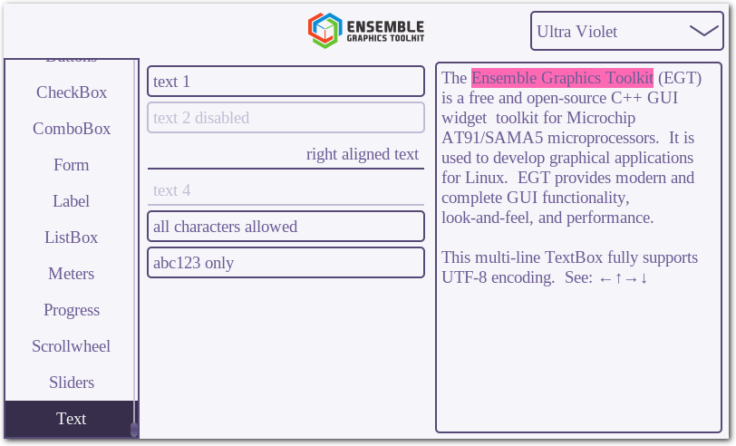
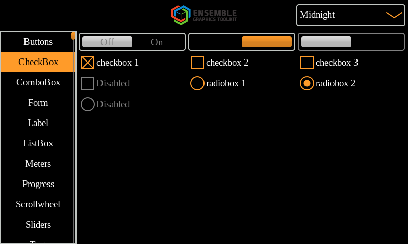
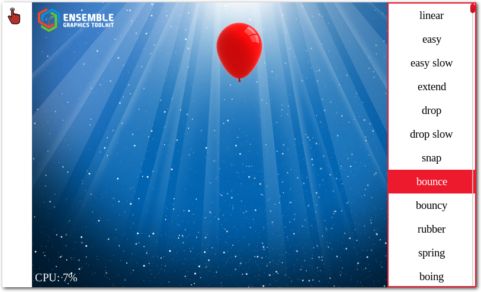
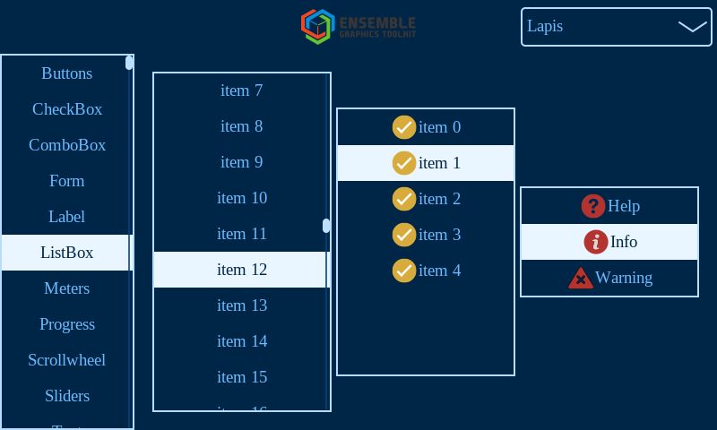

[]()
[]()

The Ensemble Graphics Toolkit (EGT) is a free and open-source C++ GUI widget
toolkit for Microchip AT91/SAMA5 microprocessors.  It is used to develop
graphical embedded Linux applications.  EGT provides modern and complete GUI
functionality, look-and-feel, and performance.

Want to help out or make some changes?  See [Contributing](CONTRIBUTING.md).

Complete [EGT Programmers Manual](https://linux4sam.github.io/egt-docs/)
with API reference is available for the latest version.

***
## Features

- Anti-aliased 2D vector graphics.
- Modern C++ design and simplicity.
- Optimized for Microchip microprocessors running Linux.
- DRM/KMS, X11, and fbdev backends.
- libinput, tslib, and evdev input support for mouse, keyboard, and touchscreen.
- UTF-8 encoding with internationalization and localization support.
- Support for libplanes and hardware LCD overlay planes.
- Built in and simple animation support for creating custom effects.
- A rich and extensible default widget set designed for embedded touchscreens.
- Multimedia support for video playback, raster images, and vector graphics.
- Customizable look and feel with themeable widget drawing, colors, and fonts.

***
## Build

To build for a PC, first install required dependencies:

```sh
sudo apt install build-essential automake autoconf libtool pkg-config \
    libdrm-dev libinput-dev libcairo-dev libjpeg-dev libmagic-dev gettext
```

Optional, but recommended, dependencies include:

```sh
sudo apt install librsvg2-dev liblua5.3-dev libcurl4-openssl-dev \
     libxkbcommon-dev xkb-data
sudo apt install libgstreamer1.0-dev libgstreamer-plugins-base1.0-dev
sudo apt install libplplot-dev plplot-driver-cairo
sudo apt install libasound2-dev libsndfile1-dev
```

Then, clone the source and build.

```sh
git clone --recursive https://github.com/linux4sam/egt.git
cd egt
./autogen.sh
./configure
make
```

You can run the examples in the `examples` directory at this point.  If you need
to compile against the EGT library, or run the compile example below, the
simplest option is to simply install the library.

```sh
make install
```

On some systems, when running the install command, you may need root access.
For example,

```sh
sudo make install
```

On some systems, the default install path will be under /usr/local/.  You may
need to follow up the install command by running ldconfig so that the dynamic
loader can find the egt library.  This may also require root access.

```sh
sudo ldconfig
```

***
## Example

And now comes the obligatory complete EGT application that can be compiled and
run (assuming you followed the steps above to build and install the EGT library).
This example shows creating the Application object, and then a Window, and a
Button on the center of the screen.

```cpp
#include <egt/ui>

int main(int argc, const char** argv)
{
    egt::Application app(argc, argv);

    egt::TopWindow window;
    egt::Button button(window, "Press Me");
    egt::center(button);
    window.show();

    return app.run();
}
```

To link this example application, saved as example.cpp, use g++ and pkgconfig to
pull in the required compiler flags.

```sh
g++ -std=c++14 example.cpp -o example `pkg-config libegt --cflags --libs` -pthread
```

Then, run.

```sh
./example
```

***
## Screenshots











***
## License

EGT is released under the terms of the `Apache 2` license. See the [COPYING](COPYING)
file for more information.
